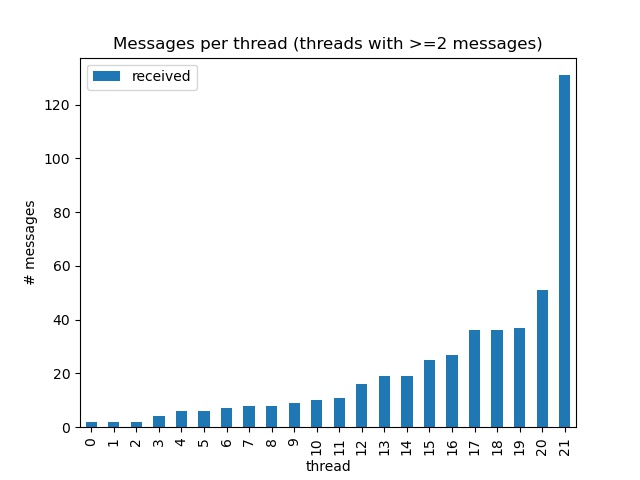
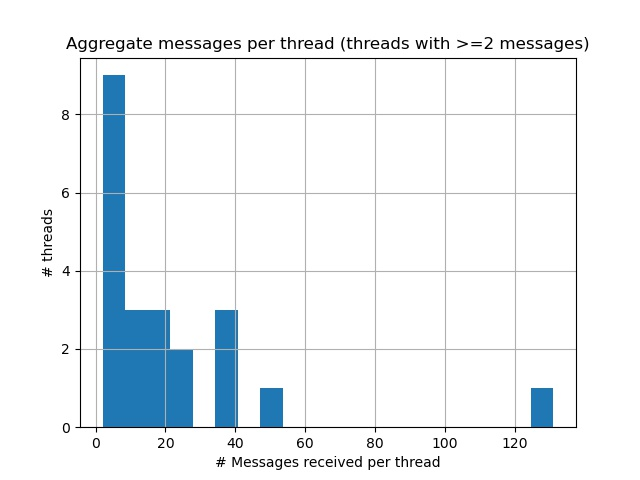
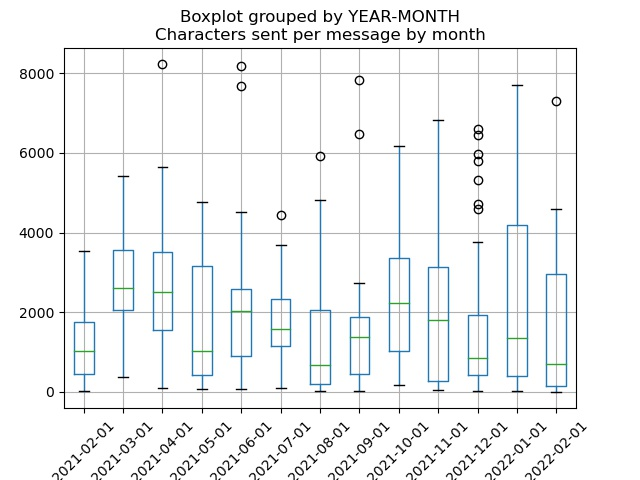
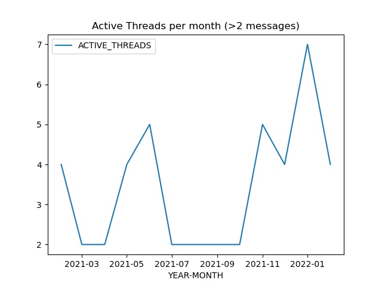
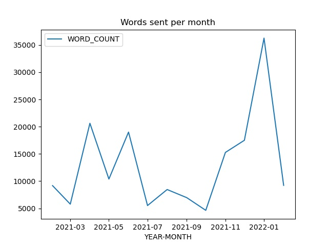

# Overview

This project contains python scripts for downloading your inbox messages from Reddit and analyzing them.

This is focused on direct messages sent back and forth between users.

Not:
- Posts
- Post replies
- Post comments

## Goals:

- Support ad-hoc data analysis of message stats
- Separate the downloading of raw data and the analytics
- Provide some out-of-the-box stats and graphs of interest
- Fully anonymize any stats or graphs to make it easy to share results publicly.
  e.g. no usernames, thread subjects, etc. appear in generated stats or graphs

## Non-goals:

- One-button operation or web-hosted operation.
  These scripts use your Reddit login and account-specific access tokens to run.

## Scripts

There are two scripts.

The first one downloads all of your messages (with metadata) and saves them as a CSV file.

The second analyzes the CSV file and produces aggregate stats and graphs.

## Example stats:

```
****************************************************
** THREAD SUMMARY
****************************************************
   Total Threads                       =   67
   Threads with no replies             =   38 (57%)
   Threads with at least 1 reply       =   29 (43%)
 
****************************************************
** THREAD DETAILED RESPONSE RATES 
****************************************************
   Threads with 1-5 replies            =   11 (16%)
   Threads with 6-20 replies           =   11 (16%)
   Threads with 21-50 replies          =    5 ( 7%)
   Threads with >50 replies            =    2 ( 3%)
 
****************************************************
** THREAD MISC STATS 
****************************************************
   Threads I didn't respond to         =    0 ( 0%)
   Threads with a now-deleted partner  =   18 (27%)
 
****************************************************
** MESSAGE STATS 
****************************************************
   Total Messages Sent                 =        501
   Total Messages Received             =        479
 
   Total Words Sent                    =    168,766
   Total Words Received                =    106,618
 
   Total Characters Sent               =    960,460
   Total Characters Received           =    593,796
 
   Avg chars sent per message          =      1,917
   Avg chars received per message      =      1,240
```

## Example Graphs:









